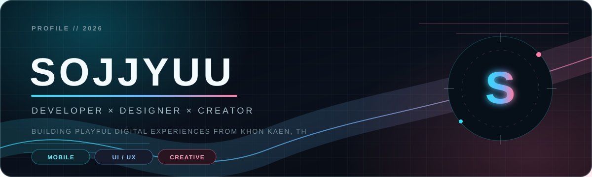
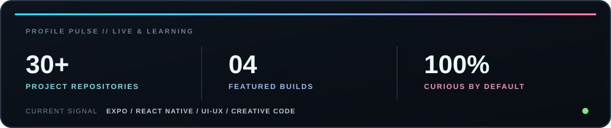

  

  
  
  

  <em>I turn ideas into playful, polished digital experiences.</em>

## `01 // HELLO`

<table>
  <tr>
    <td width="58%" valign="top">
      <h3>Hi, I'm Sojjyuu 👋</h3>
      

        A developer and designer based in <strong>Khon Kaen, Thailand</strong>.
        I enjoy building mobile apps, interactive websites and creative projects
        where thoughtful UI meets code that actually works.
      

      

        My work is inspired by games, anime and bold visual systems — especially
        experiences that feel expressive without sacrificing usability.
      

    </td>
    <td width="42%" valign="top">
      <h3>Now exploring ✦</h3>
      <ul>
        <li>Expo &amp; React Native applications</li>
        <li>UI/UX and visual identity</li>
        <li>Game development and interaction</li>
        <li>AI-assisted creative workflows</li>
      </ul>
    </td>
  </tr>
</table>

## `02 // TOOLBOX`

<strong>Code &amp; Mobile</strong>

  
  
  
  
  
  
  
  
  

<strong>Design &amp; Creative</strong>

  
  
  
  
  
  

## `03 // FEATURED WORK`

<table>
  <tr>
    <td width="50%" valign="top">
      <h3><a href="https://github.com/Sojjyuu/camera-studio-expo">📸 Camera Studio</a></h3>
      
Expo camera app with three photo filters, polished permission flows and Gallery saving.

      
<code>React Native</code> <code>TypeScript</code> <code>Expo</code> <code>Skia</code>

    </td>
    <td width="50%" valign="top">
      <h3><a href="https://github.com/Sojjyuu/PokedexTeamBuilder">⚡ Pokédex Team Builder</a></h3>
      
Search, filter and save favourites — then build a Pokémon team of up to six.

      
<code>React Native</code> <code>Expo Router</code> <code>PokéAPI</code>

    </td>
  </tr>
  <tr>
    <td width="50%" valign="top">
      <h3><a href="https://sojjyuu.github.io/">🎭 Personal Website</a></h3>
      
A visual portfolio shaped by bold typography, game UI and anime-inspired art direction.

      
<code>HTML</code> <code>CSS</code> <code>JavaScript</code>

    </td>
    <td width="50%" valign="top">
      <h3><a href="https://github.com/Sojjyuu/Game2D">🎮 Game2D</a></h3>
      
A collection of 2D game experiments exploring interaction, movement and game systems.

      
<code>Game Dev</code> <code>2D</code> <code>Creative Coding</code>

    </td>
  </tr>
</table>

## `04 // PROFILE PULSE`

  

## `05 // LET'S CONNECT`

  
  
  
  

 

  <code>SOJJYUU.DEV</code> &nbsp;✦&nbsp; BUILT WITH CURIOSITY, COLOR &amp; A LITTLE PERSONA ENERGY

